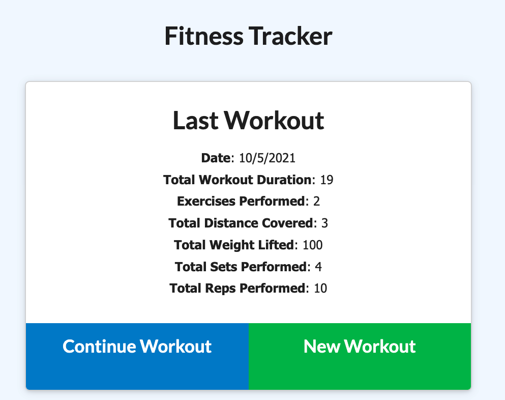
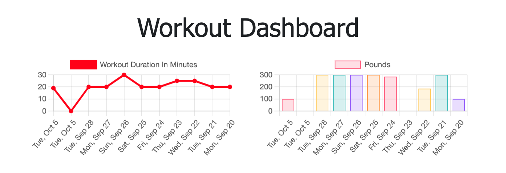

# Fitness Tracker Workout

A application to view, create, and track a daily workout regime. The user is able to log multiple excercises in a workout on any given day. Not only that but they are able to track the name, type, weight, sets, reps, and duration of that specific exercise.

## Requirements

<!-- ----------------------- -->

```
If you choose to accept your mission....
Add exercises to the most recent workout plan.

Add new exercises to a new workout plan.

View the combined weight of multiple exercises from the past seven workouts on the stats page.

View the total duration of each workout from the past seven workouts on the stats page.
```

## Screenshot

<!-- ----------------------- -->



[Video Demostration HERE!](https://www.youtube.com/watch?v=4z_cVmWalCE)

## Technologies

<!-- ----------------------- -->

- Express
- Mongo DB
- Mongoose
- Morgan
- Node.js

## Resources and Dependancies

<!-- ----------------------- -->

- [Mongoose](https://www.npmjs.com/package/mongoose)<br />
  command-line: `npm i mongoose`

- [Morgan](https://www.npmjs.com/package/morgan)<br />
  command-line: `npm i morgan`

- [nodemon](https://www.npmjs.com/package/nodemon)<br />
  command-line: `npm i nodemon`

- [express](https://www.npmjs.com/package/express)<br />
  command-line: `npm i express`

[MongoDB - addFields (aggregation)](https://docs.mongodb.com/manual/reference/operator/aggregation/addFields/)

[MongoDB - sumOperator](https://docs.mongodb.com/manual/reference/operator/aggregation/sum/)

[MongoDB - aggregateFunctions](https://mongoosejs.com/docs/api.html#aggregate_Aggregate)

## Getting Started

- In order to get started you will need to set the enviorment variable `MONGODB_URI` set correctly. <br />
  For example if deploying to Heroku set `Config Vars` in the setting page.

-Note you will need to ensure Heroku instance can access mongodb server by adjusting the atlas cluster network access rules.

## Helpful Links

- [MongoDB Website](https://www.mongodb.com/)
- [Robo 3T Website](https://robomongo.org/download)
- [MongoJS Documentation](https://www.npmjs.com/package/mongojs)
- [Mongoose Documentation](http://mongoosejs.com/docs/guide.html)
- [routes on Node.js and MongoDB](https://www.geeksforgeeks.org/restfull-routes-on-node-js-and-mongodb/)

## Heroku

<!-- ----------------------- -->

[Heroku](https://mysterious-river-96466.herokuapp.com/)

<!-- mysterious-river-96466 -->

## Application

<!-- ----------------------- -->

[URL to the github repo](https://github.com/beachbrunet/Fitness_tracker_workout)

## Contributions and Contact Information

<!-- ----------------------- -->

```
Catherine Cox
ccox.034@gmail.com
```
